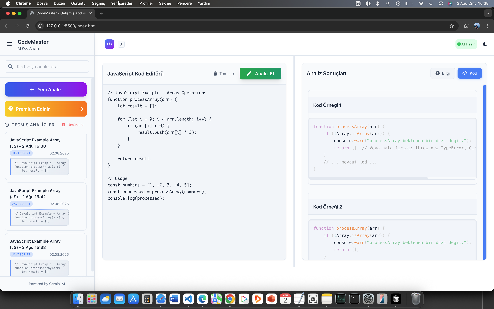
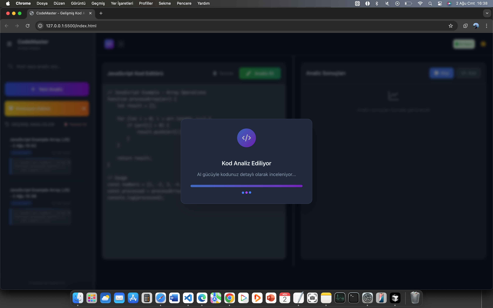
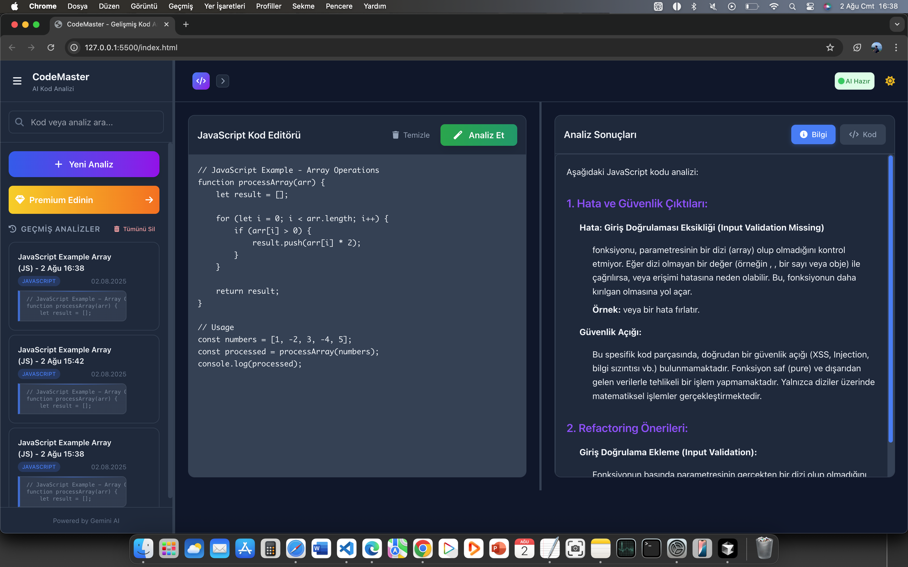
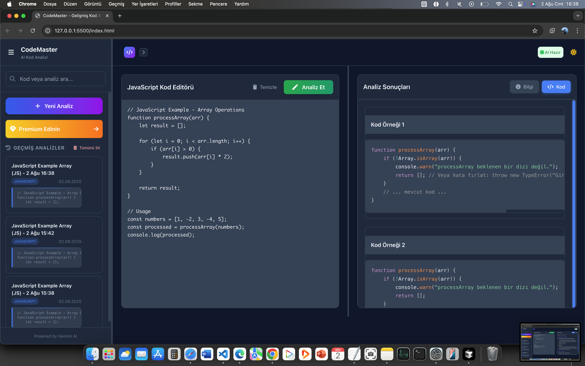
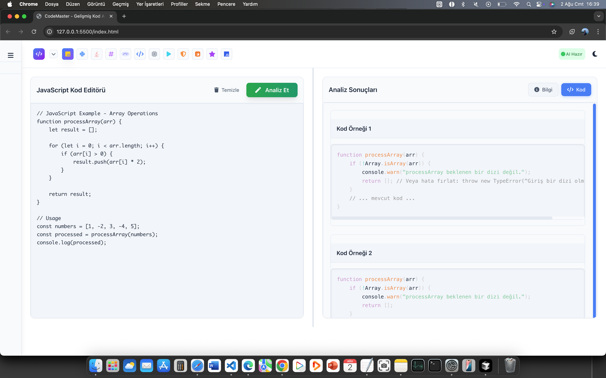
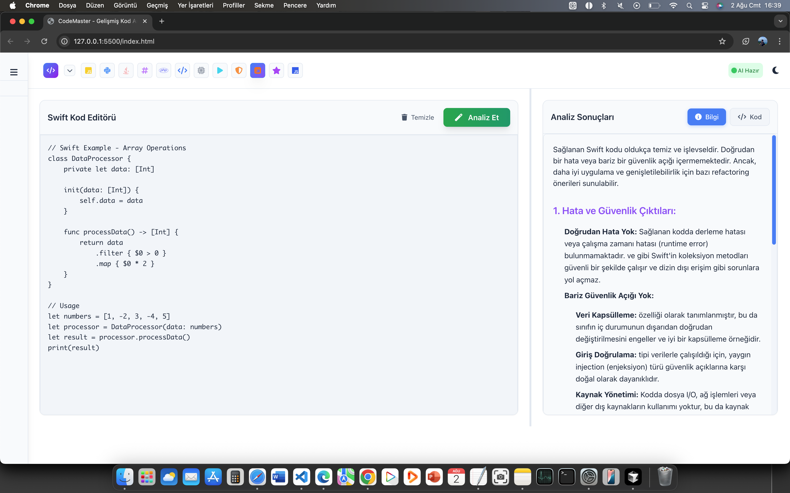

# 🚀 CodeMaster - AI-Powered Code Analysis Platform

Modern, güvenli ve kullanıcı dostu kod analiz platformu. Gemini AI ile kodunuzu analiz edin, hataları tespit edin ve refactoring önerileri alın.

## 📸 Ekran Görüntüleri

### ☀️ Gündüz Modu / Ana Ekran


### 💻 Kod Analiz Ekranı


### 📊 Analiz Sonuçları Bilgi Bölümü


### 📊 Analiz Sonuçları Kod Bölümü


### 🌐 Dil Seçimi


### 📐 Resizer Bar Durum 1


### 📐 Resizer Bar Durum 2


**Ekran resmi eklemek için:**
1. Resimlerinizi `screenshots/` klasörüne koyun
2. `git add screenshots/`
3. `git commit -m "📸 Ekran resimleri eklendi"`
4. `git push origin main`

## ✨ Özellikler

### 🎯 **Temel Özellikler**
- **Çoklu Dil Desteği**: JavaScript, Python, Java, C#, PHP, C++, C, Go, Rust, Swift, Kotlin, TypeScript
- **AI Destekli Analiz**: Gemini AI ile gelişmiş kod analizi
- **Gerçek Zamanlı Sonuçlar**: Anında analiz sonuçları
- **Geçmiş Yönetimi**: Analiz geçmişinizi kaydedin ve yönetin
- **Responsive Tasarım**: Mobil ve desktop uyumlu

### 🎨 **Kullanıcı Arayüzü**
- **Modern Tasarım**: Temiz ve şık arayüz
- **Tema Desteği**: Açık/koyu tema seçeneği
- **Slideable Sidebar**: Ayarlanabilir kenar çubuğu
- **Content Resizer**: Kod editörü ve sonuçlar arasında boyutlandırma
- **Dinamik Başlıklar**: Seçilen dile göre değişen başlıklar

### 🔧 **Gelişmiş Özellikler**
- **Kod Önizleme**: Geçmiş analizlerde kod önizlemesi
- **Arama Fonksiyonu**: Analiz geçmişinde arama yapın
- **Tek Tek Silme**: Geçmiş analizleri tek tek silin
- **Toplu Silme**: Tüm analizleri tek seferde silin
- **Otomatik Kaydetme**: Analizler otomatik olarak kaydedilir

## 🛠️ Kurulum

### Gereksinimler
- Node.js (v14 veya üzeri)
- npm veya yarn
- Gemini AI API anahtarı

### Adımlar

1. **Projeyi klonlayın**
```bash
git clone https://github.com/kullaniciadi/codemaster.git
cd codemaster
```

2. **Bağımlılıkları yükleyin**
```bash
npm install
```

3. **Environment dosyasını oluşturun**
```bash
cp .env.example .env
```

4. **API anahtarınızı ekleyin**
```env
GEMINI_API_KEY=your_api_key_here
PORT=3000
NODE_ENV=development
```

5. **Sunucuyu başlatın**
```bash
# Development
npm run dev

# Production
npm start
```

6. **Tarayıcıda açın**
```
http://localhost:3000
```

## 📁 Proje Yapısı

```
codemaster/
├── index.html          # Ana HTML dosyası
├── style.css           # CSS stilleri
├── script.js           # Frontend JavaScript
├── server.js           # Node.js sunucu
├── package.json        # Proje bağımlılıkları
├── .env               # Environment değişkenleri
├── .gitignore         # Git ignore dosyası
├── README.md          # Proje dokümantasyonu
└── __mocks__/         # Test mock dosyaları
    ├── firebase-app.js
    ├── firebase-auth.js
    ├── firebase-firestore.js
    └── marked.esm.js
```

## 🚀 Kullanım

### Kod Analizi
1. **Dil Seçin**: Üst bardaki dil seçeneklerinden birini seçin
2. **Kod Yazın**: Kod editörüne kodunuzu yazın
3. **Analiz Edin**: "Analiz Et" butonuna tıklayın
4. **Sonuçları İnceleyin**: Bilgi ve kod sekmelerinde sonuçları görün

### Geçmiş Yönetimi
- **Analizleri Görüntüleme**: Sol sidebar'da geçmiş analizlerinizi görün
- **Arama**: Arama çubuğu ile analizlerinizi arayın
- **Silme**: Tek tek veya toplu silme işlemleri yapın

### Tema Değiştirme
- **Tema Toggle**: Sağ üst köşedeki ay/güneş ikonuna tıklayın
- **Otomatik Kaydetme**: Tema tercihiniz otomatik kaydedilir

## 🔧 API Endpoints

### POST `/api/analyze-code`
Kod analizi için ana endpoint.

**Request Body:**
```json
{
  "code": "function example() { return 'hello'; }",
  "language": "javascript"
}
```

**Response:**
```json
{
  "analysis": "Analiz sonuçları...",
  "status": "success"
}
```

### GET `/health`
Sunucu sağlık kontrolü.

## 🧪 Test

```bash
npm test
```

## 🔒 Güvenlik

- **API Key Güvenliği**: API anahtarları server-side'da saklanır
- **Rate Limiting**: API istekleri sınırlandırılır
- **Input Validation**: Tüm girdiler doğrulanır
- **CORS**: Cross-origin istekler güvenli şekilde yönetilir

## 📝 Lisans

Bu proje MIT lisansı altında lisanslanmıştır.

## 🤝 Katkıda Bulunma

1. Fork yapın
2. Feature branch oluşturun (`git checkout -b feature/amazing-feature`)
3. Değişikliklerinizi commit edin (`git commit -m 'Add amazing feature'`)
4. Branch'inizi push edin (`git push origin feature/amazing-feature`)
5. Pull Request oluşturun

## 📞 İletişim

- **GitHub**: [@kullaniciadi](https://github.com/kullaniciadi)
- **Email**: ornek@email.com

## 🙏 Teşekkürler

- [Gemini AI](https://ai.google.dev/) - AI analiz gücü için
- [Tailwind CSS](https://tailwindcss.com/) - CSS framework için
- [Font Awesome](https://fontawesome.com/) - İkonlar için

---

⭐ Bu projeyi beğendiyseniz yıldız vermeyi unutmayın! 
